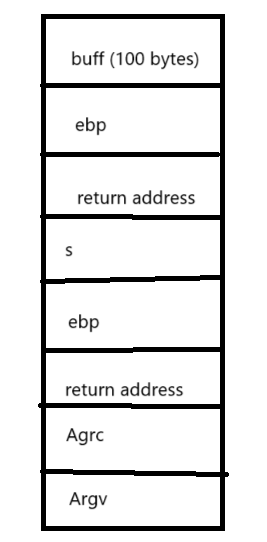
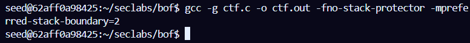
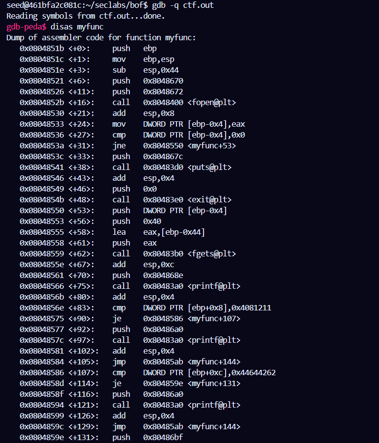
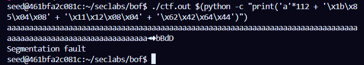

## CTF
Source Code:
```
#include <stdio.h>
#include <string.h>
#include <stdlib.h>
void myfunc(int p, int q)
{
	char filebuf[64];
	FILE *f = fopen("flag1.txt","r");
	if (f == NULL) {
		printf("flag1 is missing!\n");
		exit(0);
	}
	fgets(filebuf,64,f);

	printf("myfunc is reached");
	if (p!=0x04081211)
	{
		printf(", but you fail to get the flag");
		return;
	}
	if (q!=0x44644262)
	{
		printf(", but you fail to get the flag");
		return;
	}
	printf("You got the flag\n"); 
}
void vuln(char* s)
{
	char buf[100];
	strcpy(buf,s);
	puts(buf);
}
int main(int argc, char* argv[])
{
	vuln(argv[1]);
    return 0;
} 
```
<br>

Stack Frame

<br>



<br>

Complie by gcc: <br>

`gcc -g ctf.c -o ctf.out -fno-stack-protector -mpreferred-stack-boundary=2 `

<br>



<br>

Run `gdb` and `disas myfunc`: <br>



<br>

Find out `myfunc` address: <br> 


<br>

Look at stack frame: <br>

We use 112 bytes 'a' to fill **buff**(100 bytes), **ebp**(4 bytes), **return address(vuln)**(4 bytes), s <br>

`myfunc` **address** <br>

`0x04081211` **p** values
`0x44644262` **q** values

